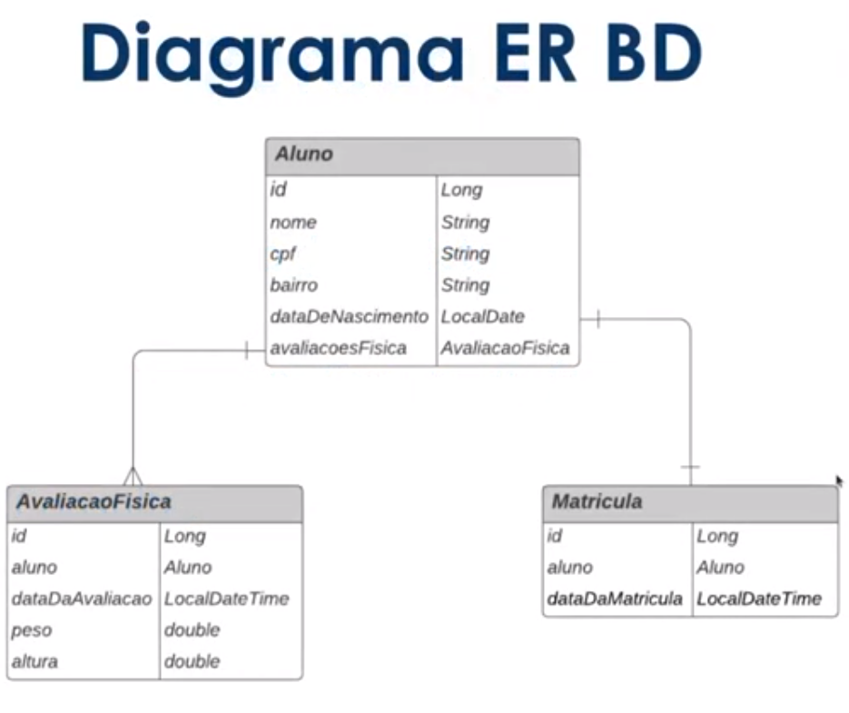

# Desafio DIO - Academia Digital 
 

# Sobre o projeto

Academia Digital é um projeto/desafio proposto pela instrutora Camila Cavalcante no bootcamp Spring Framework Experience - plataforma Digital Innovation One. 
É uma API REST desenvolvida com SpringFramework + Thymeleaf para renderização das paginas com Bootstrap.

## Diagrama ER

## Executando o projeto
- git clone https://github.com/willhc1984/academia_digital_dio
- cd academia_digital_dio
- docker build -t spring-app .
- docker run -p 8080:8080 spring-app

# Tecnologias utilizadas
## Back end
- Java 17
- Spring Boot 2.7.1
- JPA / Hibernate

## Front end
- HTML/CSS/Javascript
- Bootstrap 4
- Thymeleaf

## Ferramentas
- Maven
- Banco de dados H2
- Lombok
- Spring Tool Suite 4

# Autor

William Henrique Campos

https://www.linkedin.com/in/william-henrique-campos-98568813a/
